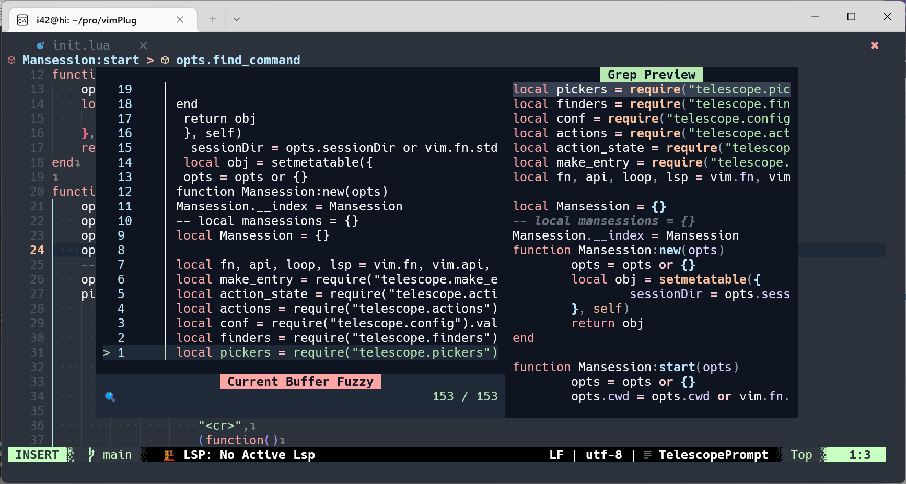
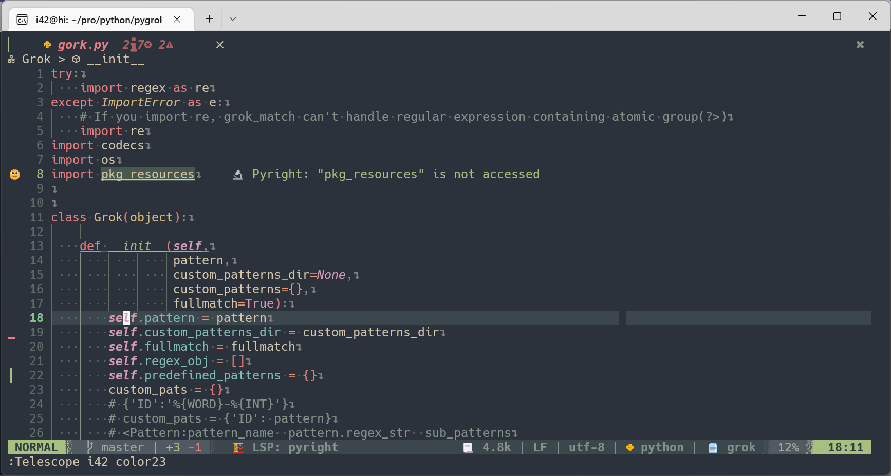
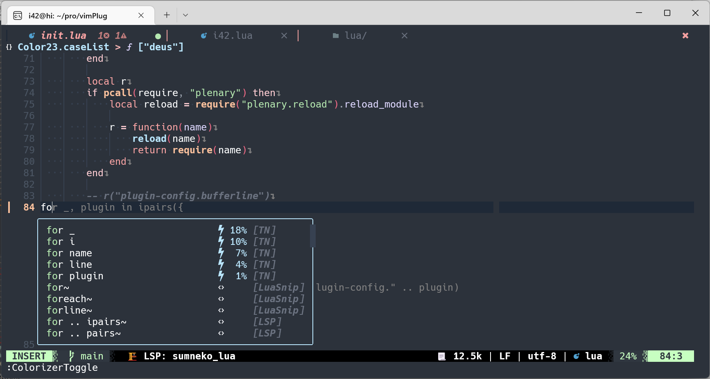
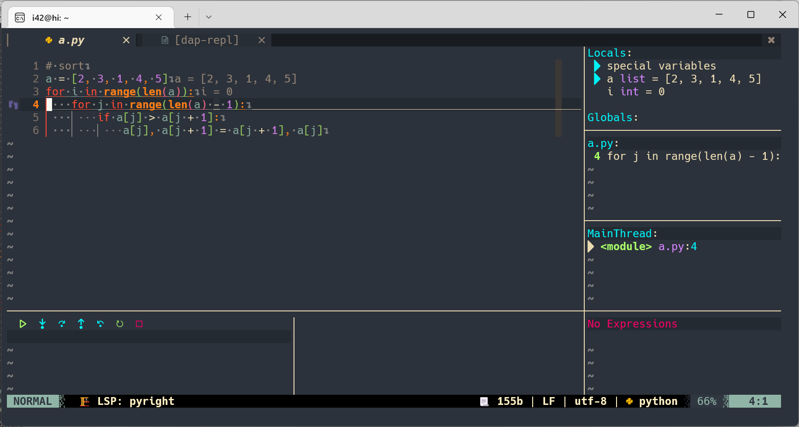
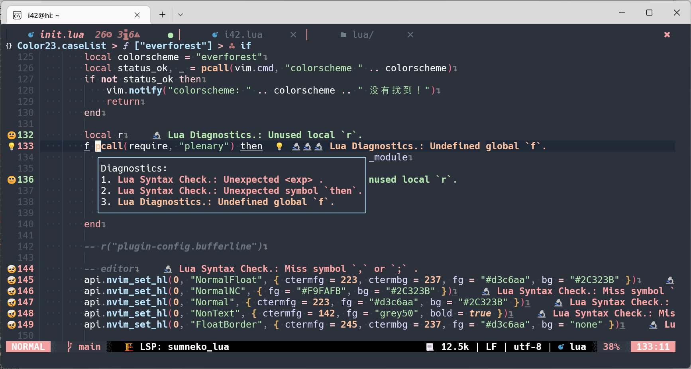
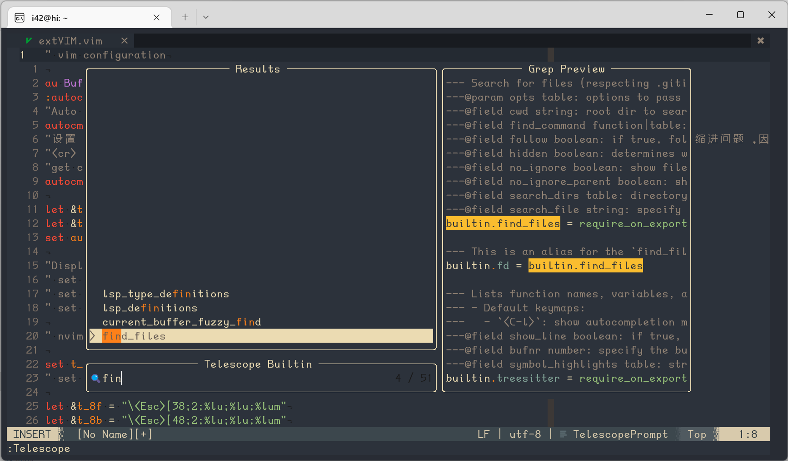
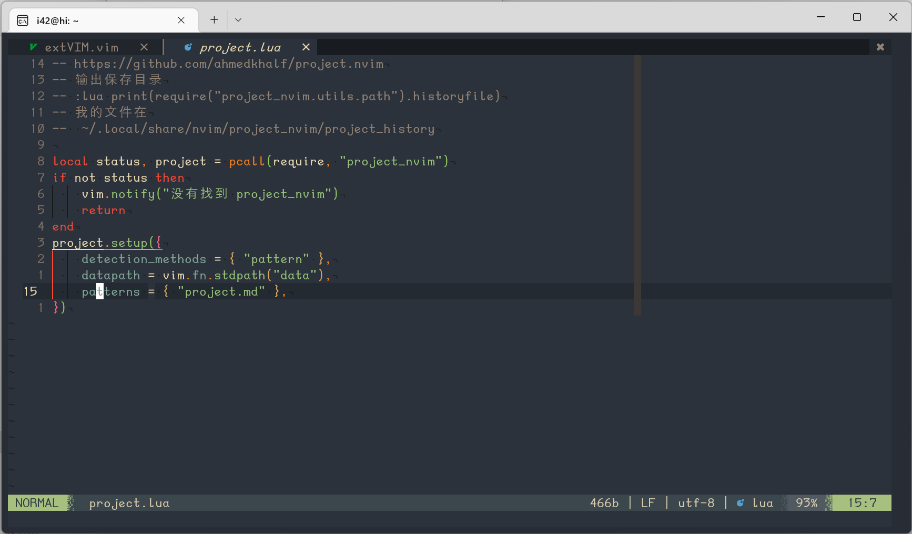
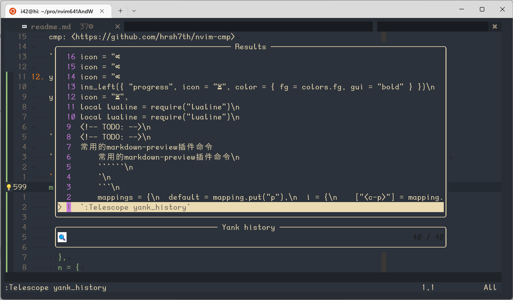
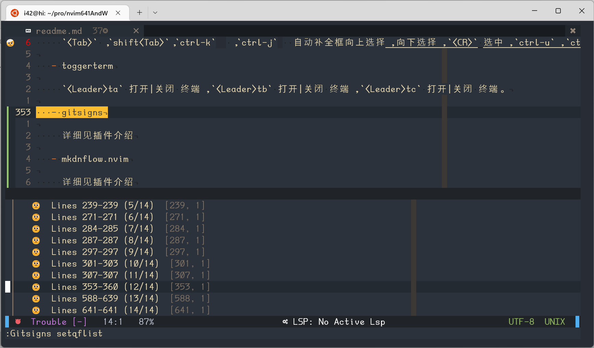
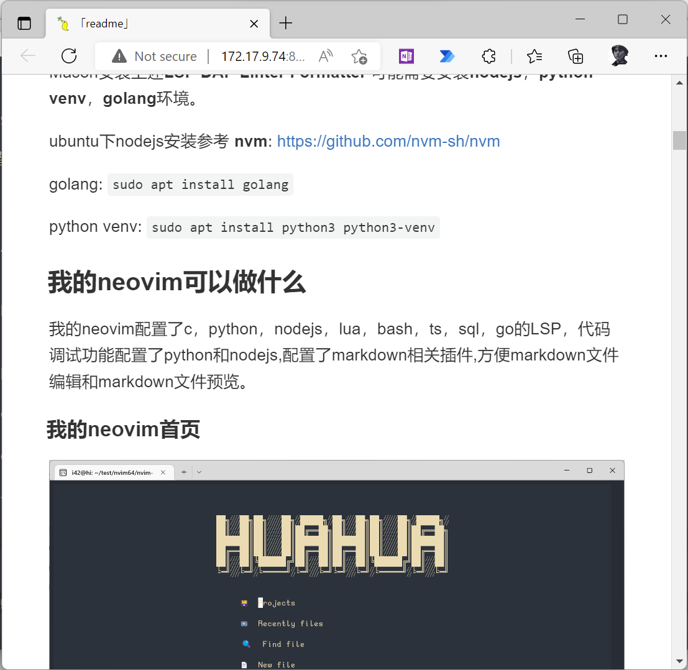

# neovim IDE基本使用说明

---

## 安装须知

### 需要准备的东西

- 请确保系统有`git`，`tar`，`curl`，`wget`，`unzip` （如果需要使用lazygit则请确保lazygit的安装） 和基本的编译环境例如 `gcc`和`libstdc++` 库（treesitter插件需要这些编译环境），ubuntu可以通过`sudo apt install git tar curl wget unzip build-essential` 安装上面所需软件。

- 网络环境可以流畅的访问github

- 如果已经有自己的nvim配置文件，务必确保自己的配置文件~/.config/nvim 不会干扰本nvim的配置文件，可以将自己的配置文件目录的名字进行修改，以免产生冲突

### 如何安装

nvim64.tar包的目录结构如下

```plain
├── initial.sh
├── int42.sh
├── nvim-linux64.tar
├── open.sh
├── runtime
└── share
```

nvim-linux64.tar是neovim官方的portable版  <https://github.com/neovim/neovim/releases/download/v0.8.1/nvim-linux64.tar.gz>

将nvim64.tar包 <https://github.com/HUAHUAI23/nvim64/releases/download/v2.0/nvim64.tar> 下载下来后执行如下命令

```plain
tar -xf nvim.tar
cd nvim64
bash initial.sh
rm -rf trush
cd nvim-linux64/bin/

# 将为当前shell环境添加alias，即终端输入n就可以打开neovim，等效于nvim-linux64/bin/nvim
source int42.sh
```

或者下载打包好的版本 <https://github.com/HUAHUAI23/nvim64/releases/download/v2.0/nvim64.tar.gz>，打包好的版本已经将插件和LSP相关的东西打包进去了，所以**不需要执行下面`:TSupdate` `:PackSync` `:MasonInstall` 等操作**，但是依然要保证系统有python venv和nodejs环境。

```plain
# 打包版本的使用

tax -xf nvim64.packaged.tar.gz
cd nvim64/nvim-linux64/bin
source int42
n
# 也可以直接 nvim64/nvim-linux64/bin/nvim

```

lite版本参考: <https://github.com/HUAHUAI23/nvim64lite>

第一次进入neovim后，neovim会自动下载插件,下载完插件后可以退出待第二次继续进入neovim，第二次进入neovim时请执行`:TSupdate` 更新treesitter和执行`:PackSync` 更新插件，为保证LSP正常工作，须执行`:Mason` 然后将这些全部安装`"bash-language-server", "shfmt", "shellcheck", "stylua", "lua-language-server", "black", "pyright", "debugpy", "clang-format", "clangd", "cpptools", "node-debug2-adapter", "typescript-language-server", "quick-lint-js", "prettier", "sqls", "sql-formatter", "json-lsp", "html-lsp", "fixjson", "emmet-ls", "css-lsp", "gopls", "codelldb", "vim-language-server"`

在第二次进入neovim后 输入`:MasonInstall  bash-language-server shfmt shellcheck stylua lua-language-server black pyright debugpy clang-format clangd cpptools node-debug2-adapter typescript-language-server quick-lint-js prettier sqls sql-formatter json-lsp html-lsp fixjson emmet-ls css-lsp markdownlint gopls vim-language-server codelldb`

如果没成功可以多执行几次 `:PackSync` 保证Mason插件成功安装，然后再执行 `:MasonInstall`

Mason安装上述**LSP** **DAP** **Linter** **Formatter** 可能需要安装**nodejs**，**python** **venv**，**golang**环境。

ubuntu下nodejs安装参考 **nvm**: <https://github.com/nvm-sh/nvm>

golang: `sudo apt install golang`

python venv: `sudo apt install python3 python3-venv`

**javascript typescript** 的格式化插件用的是 `deno` 不是 `prettier`,需要单独安装 [deno](https://github.com/denoland/deno)

**下面视频展示第一次安装我的neovim过程**

https://user-images.githubusercontent.com/43649186/205034422-2c2df144-e568-485b-8f7d-5c3a831b3536.mp4

### 我的neovim可以做什么

我的neovim配置了c，python，nodejs，lua，bash，ts，sql，go, vim的LSP，代码调试功能配置了python, c, nodejs，配置了markdown相关插件，方便markdown文件编辑和markdown文件预览。

#### 我的neovim首页


配置有三个配色，可以通过颜色插件进行选择 **`Telescope i42 color23`**

对于终端背景与nvim有差距层次问题可以通过让终端背景色与nvim背景色一致解决 **背景色** `#2C323B` nvim 背景高亮组 **`Normal` `NormalNC` `NormalFloat`**


**deus** <https://github.com/theniceboy/nvim-deus>


**tundra** <https://github.com/sam4llis/nvim-tundra>




**everforest** <https://github.com/sainnhe/everforest>



---

## neovim插件介绍

### 写在前面,约定习俗 <!-- omit from toc -->

- `<>` 表示必选项，例如`<number>` 表示必须选择一个数字。

- `[]` 表示可选项。

- `ctrl-i` 表示组合键 `ctrl` `i` ,`sp` 表示组合键 `s` `p` 。

- `<space>` 表示空格键 `<CR>` 表示enter键 `<Tab>` 表示Tab键，本配置的`<Leader>`表示键位`;`。

- `|` 表示或

- `:h ZZ` 表示在vim normol模式下输入`:h ZZ` ，即进入command模式然后输入h ZZ，h是help的缩写，即help命令。

## 目录

- [1 vim](#1-vim)
  - [1.1 vim基础](#11-vim基础)
- [2 我的neovim插件配置](#2-我的neovim插件配置)
  - [2.1 配置文件目录结构说明](#21-配置文件目录结构说明)
  - [2.2 neovim键位映射说明](#22-neovim键位映射说明)
  - [2.3 插件介绍](#23-插件介绍)

## 1 vim

### 1.1 vim基础

- 常用模式

  vim有四种常用模式，分别是命令模式（command），编辑模式（insert），普通模式（normal），视图模式（view）。

- 模式切换

  normal模式下通过`i` `I` `o` `O` `a` `A` 进入insert模式，insert模式通过`Esc` 进入normal模式，normal模式通过`V` `Ctrl-v` `v`  `ctrl-q` 进入view模式，normal模式通过`:` 进入命令模式。

- normal模式下常见操作

  `hjkl` 方向键上下左右

  ```textile
               k
             h   l
               j
  ```

  `0` `^` 光标跳到行首，`$` 光标跳到行尾，`gg` 光标跳到首行，`G` 光标跳到末行，`<number>gg` 跳转到number行。

  `ctrl-i` 光标跳转至上一个位置，`ctrl-o` 光标跳转至下一个位置，可通过`:jumps` 命令查看具体的跳转表。

  `f <a-z|A-Z>` 在当前行查找字母，并把光标跳转至该字母。

  `/<word> |?<word>` 在全文种搜索指定文字。

  `ZZ` 退出vim，与`wq` 相似，但有一些差异，具体可参考`:h ZZ` 。

  `r` 替换单个字母，`R` 连续替换，`x` 删除光标位置处字符，`X` 删除光标前面的一个字符，`D` 当光标处到行尾的字符剪切至vim剪切板寄存器中，`dd` 将当前行内容剪切至vim剪切板寄存器中，`yy` 复制当前行内容到vim剪切板寄存器中，`u` 回退至上一个状态，`p` 将寄存器剪切板中的内容粘贴到光标位置，`w` 光标跳转至下一个单词首字母，`b` 光标跳转至上一个单词首字母，`e` 光标跳转至当前单词尾字母。

- 一些有关vim motion操作

  normal模式下motion操作可以更方便的编辑文字，下面列举一些例子：

  `dw` 将光标位置一直到该单词词尾剪切至vim剪切板寄存器中，该行为等同`de` ,`diw` 将光标位置单词剪切至vim剪切板寄存器中，`d5l` 从光标位置向左一共5个字符剪切至vim剪切板寄存器中，`di'` 将单引号内的内容剪切至vim剪切板寄存器中（i可以理解为in），类似的动作还有`dG` `dfl`(将光标位置到字符l间的内容剪切至vim剪切板寄存器中) `cw` `ciw`（将当前光标位置单词剪切至vim剪切板寄存器中，并进入insert模式） `ci'` `cfl` `y6j` (从光标位置开始向下复制6行内容至vim剪切板寄存器中)，`6j` (光标向下移动6行)更多参考`:h motion` 。

- 有关光标跳转操作

  `ctrl-f` 光标向下跳转半页，`ctrl-b` 光标向上跳转半页，`ctrl-u` 光标向上跳转多行，`ctrl-d` 光标向下跳转多行，`(` 和 `)`  jump statement，`{` 和 `}` jump section， `%` 跳转至对应闭合括号，`ctrl-i` 光标跳转至上一个位置，`ctrl-o` 光标跳转至下一个位置，可通过`:jumps` 命令查看具体的跳转表。

- 与窗口相关操作

  在vim中有着window tab buffer概念，buffer即缓存区，它存储着内容，比如当前编辑的文件，这涉及到Linux的一个概念**流**，在Linux中一切都是文件都是数据，你当前编辑的文件就是一个数据流，该数据流暂存在内存的一块地址中（buffer），最后发生一次io写入到硬盘中，在Linux中硬盘也是一个文件，可以通过`ls /dev/` 查看。buffer中的数据通过window展示，即在vim中打开一个窗口展示buffer中的数据，tab则为布局方式，组织排列窗口的布局。

  ```plain
                      vim
  tab
  +----------------------+-------------------------+
  | window               | window                  |
  | 10101010101010101010 |                         |
  | 10010101010101010101 |                         |
  | 11100001010101010101 |                         |
  | 100000111~~~+-------------->buffer             |
  |                      |                         |
  +-------------------------------------------------+
  | window               |                         |
  |                      |                         |
  |                      |                         |
  |                      |                         |
  |                      |                         |
  |                      |                         |
  +----------------------+-------------------------+
  ```

  `:split` 沿着水平方向打开一个新的window，`:vsplit` 沿着垂直方向打开一个新的window。

  `:split <filename|path/to/file>` 打开一个新的文件

  `:vsplit <filename|path/to/file>`

- normal模式下一些查找操作

  `#` 向上查找光标处单词，`*` 向下查找光标处单词，`/` 进入搜索，`?` 进入搜索，`N` 在搜索中向上跳转（上一个），`n` 在搜索中向下跳转（下一个）

- 其他一些normal模式下常用功能

  `:s/a/b` 将当前行找到的第一个a替换成b

  `:s/a/b/g` 将一行中找到的a均换成b

  `:%s/a/b/g` 将当前buffer中所有的找到的a替换成b (%代表当前文件名即当前buffer)

  `:2,6s/a/b/g` 将2到6行的找到的a替换成b

  `:set nohli` 取消搜索高亮，`:set past` 设置进入粘贴模式，`:set nopas` 退出粘贴模式。

## 2 我的neovim插件配置

### 2.1 配置文件目录结构说明

neovim在启动阶段会加载目录 `$XDG_CONFIG_HOME/nvim` 下的init.vim文件或init.lua文件，sysinit.vim在neovim启动阶段也会被加载，一般这个文件在目录 `$VIM/sysinit.vim` 下，更详细的说明参考`:h config` 。在neovim启动过程中，sysinit.vim会拉起我的neovim配置,参考`:h startup`，sysinit.vim在目录 `nvim-linux64/share/nvim/` 下，我的配置文件在目录 `nvim-linux64/share/nvim/xray23/lua/` 下，下面是目录`nvim-linux64/share/nvim/xray23/lua/` 的目录结构。

```plain
├── autocmd.lua
├── basic.lua
├── cmp
│   ├── cmp.lua
│   └── snippets
│       ├── lua
│       └── vscode
├── colorscheme.lua
├── commConf.lua
├── dap
│   └── nvim-dap
│       ├── config
│       │   ├── codelldb.lua
│       │   ├── cpptools.lua
│       │   └── nodejs.lua
│       └── setup.lua
├── keybindingAlias.lua
├── keybindings.lua
├── lsp
│   ├── common-config.lua
│   ├── config
│   │   ├── bash.lua
│   │   ├── clangd.lua
│   │   ├── css.lua
│   │   ├── emmet-ls.lua
│   │   ├── gopls.lua
│   │   ├── html.lua
│   │   ├── json.lua
│   │   ├── lua.lua
│   │   ├── pyright.lua
│   │   ├── quick-lint-js.lua
│   │   ├── sqls.lua
│   │   ├── tsserver.lua
│   │   └── vimls.lua
│   ├── lsp-signature.lua
│   ├── null-ls.lua
│   ├── setup.lua
│   ├── ui.lua
│   └── vim-illuminate.lua
├── plugin-config
│   ├── bufferline.lua
│   ├── comment.lua
│   ├── dashboard.lua
│   ├── fidget.lua
│   ├── gitsigns.lua
│   ├── hop.lua
│   ├── indent-blankline.lua
│   ├── lualine.lua
│   ├── markdown-preview.lua
│   ├── mkdnflow.lua
│   ├── neoscrolL.lua
│   ├── nvim-autopairs.lua
│   ├── nvim-colorizer.lua
│   ├── nvim-notify.lua
│   ├── nvim-tree.lua
│   ├── nvim-treesitter.lua
│   ├── project.lua
│   ├── telescope.lua
│   ├── todo-comments.lua
│   ├── toggleterm.lua
│   ├── trouble.lua
│   ├── twilight.lua
│   ├── whichkey.lua
│   ├── yanky.lua
│   └── zen-mode.lua
├── plugins.lua
├── start42.lua
└── usercmd.lua
```

**autocmd.lua**为定义的一些vim autocmd比如在yank的时候高亮yank的内容，对指定文件保存时进行格式化处理，**basic.lua**为对neovim一些基本编辑属性的配置，比如定义2个空格等于一个tab，**cmp**目录里的配置文件为neovim写代码时自动补全配置,**lsp**为lsp相关配置，**dap** 为调试器相关配置，**commConf** 文件定义一些公共的配置，比如是否要展示list char（控制字符），是否启动magic search等，**start42.lua** 文件为初始文件，sysinit.vim文件拉起start42.lua，start42.lua拉起后续配置文件。

**neovim 代码补全**



**colorscheme.lua**定义了neovim的主题，配色，**dap**目录里的文件为neovim代码调试器相关配置。

**neovim 调试代码**



**init.lua**为初始化配置文件，即sysinit.vim拉起init.lua，init.lua拉起后续的配置文件，**keybindings.lua**定义neovim一些键位映射，**lsp**目录下的配置文件为neovim LSP相关配置，neovim LSP包括neovim的一些代码定义跳转，引用跳转，代码提示等。

**neovim—LSP**



**plugin-config**目录下的文件为各种插件的配置文件。

### 2.2 neovim键位映射说明

1. **基本键位映射**

   *定义neovim的Leader键为`;`,leader键是什么，详细可以参考`:h <Leader>`*

   *可以通过修改**keybindingAlias.lua**文件定义自己的键位映射*

   *配置定义的所有键位映射可以通过修改**keybindings.lua** 和**keybindingAlias.lua** 文件进行修改*

   - normal模式下键位映射

     取消了normal模式下 `H` ，`L` ，`s` ，`<F1>` 键的默认功能。

     `<F1>` 进入command模式

     `H` , `L` 光标向左移动35个字符，光标向右移动35个字符

     `sp` , `sP` 进入粘贴模式，退出粘贴模式，什么是粘贴模式参考 `:h 'paste'`

     `ctrl-u` `ctrl-d` 向上向下移动多行光标

     `ctrl-j` `ctrl-k` 向上向下移动多行光标

     `qq` 关闭当前buffer `<Leader>q` 关闭当前window，`<Leader>w` 保存当前window的buffer（将当前window的内容保存），`<Leader>WQ` 关闭所有window，`<Leader>Q` 退出neovim并且不保存buffer

     `sh` , `sv` 新建水平window，新建垂直window，`s←` ，`s→`，`s↑` ，`s↓` 上下左右切换window，`sw` 按顺时针方向依次切换window

     `sk` ，`sj` ，`s,` ，`s.` 将window向上移动2点，将window向下移动2点，将window向左移动2点，将window向右移动2点，`s=` 将window恢复默认大小

     `<ctrl-/>` 行注释

     `za`代码折叠与代码展开，`zr` `zm` 打开/关闭所有折叠，`zd` `zE` 删除当前/删除所有折叠 `zj` `zk` 移动至上一/下一折叠点。

   - insert模式下键位映射

     取消了insert模式下`ctrl-f` 的默认功能

     `<F1>` 进入command模式

     `<Leader><Leader>` 进入normal模式

     `<ctrl-/>` 行注释

   - visual模式下键位映射

     `ctrl-j` `ctrl-k` 向上向下移动多行光标

     `Y` 将内容复制到系统剪切板(非neovim剪切板)

     `F1` 进入command模式

   - command模式下键位映射

     `ctrl-j` `ctrl-k` 在命令补全窗口中向上移动向下移动

   - terminal模式下键位映射

     normal模式下`st` 水平方向上打开终端window

     normal模式下`stv` 垂直方向上打开终端window

     `<Esc>` terminal模式回到normal模式

     `s←` ，`s→`，`s↑` ，`s↓` 上下左右切换window

     `F1` 进入command模式

2. **插件键位映射**

   *插件键位一般是在normal模式下*

   - nvimTree

     `<space>1` 打开|关闭 nvimTree

   - LSP

     `;rn`，`;ra` 重命名变量

     `;ca` code action

     `gd` 跳转至定义，`gh` 打开文档，`gr` 跳转至引用，`g←` ，`g→` 跳转至上一个语法检查，跳转至下一个语法检查，`gl` 打开语法检查列表，`;gl` goto type definitions, `;gi` goto implementations，`;gh` open signature-help，`<Leader>f` 格式化代码，`<space>3` open code outline

   - DAP

     `<F5>` 打开代码调试，`<F6>` 执行下一步，`<space>w` 关闭代码调试，`<space>T` 去掉所有中断点，`<space>t` 标记中断点，`<space>h` 光标处表达式求值，visual模式下 `<Leader><Leader>` 光标处表达式求值。

   - bufferline

     `<Leader>j` `<Leader>k` 切换到左边的buffer，切换到右边的buffer，`<Leader>h` `<Leader>l` 向左交换buffer，向右交换buffer。

   - telescope

     normal模式和insert模式下 `ctrl-f` 在当前buffer中查找内容，`<space>4` 查找项目文件，`<space>5` 打开buffer列表，`<space>s` 打开会话列表。

   - cmp

     `<Tab>` ，`shift<Tab>`（代码snippet节点上下跳转），`ctrl-k` ，`ctrl-j`（代码snippet条件节点上下选择）  自动补全框向上选择，向下选择，`<CR>` 选中，`ctrl-u`，`ctrl-d` 自动补全扩展窗口向下移动，向上移动，`ctrl-<Space>` 打开自动补全，`<Leader>ee` 关闭自动补全。

   - toggerterm

     `<Leader>ta` 打开|关闭 终端，`<Leader>tb` 打开|关闭 终端，`<Leader>tc` 打开|关闭 终端 `<Leader>td` 打开关闭特色终端[lazygit](https://github.com/jesseduffield/lazygit) 需要安装**lazygit**

   - copilot

     `<Leader>cc` 接受copilot的建议，配置默认关闭了copilot，需要的自行启用

   - hop

     `<Leader>gg` `<Leader>gv` normal和insert模式下打开行跳转和word跳转，`<Leader>gb` insert模式下打开 pattern

   - yanky

     `<Leader>yy` insert和normal模式打开yanky面板（剪切板历史）

   - gitsigns

     详细见插件介绍

   - mkdnflow.nvim

     详细见插件介绍

### 2.3 插件介绍

1. LSP

   LSP相关详细内容参考 `:h lsp`
   LSP: <https://github.com/neovim/nvim-lspconfig>
   null-ls: <https://github.com/jose-elias-alvarez/null-ls.nvim>
   mason: <https://github.com/williamboman/mason.nvim>

   `:LspInfo` `:LspLog` `:NullLsInfo` `:NullLsLog` 可以查看LSP client相关情况。

2. bufferline

   bufferline：<https://github.com/akinsho/bufferline.nvim>

   `:BufferLinePick` 切换至选中的buffer

   `:BufferLinePickClose` 关闭选中的buffer

   `:BufferLineCloseLeft` 关闭当前buffer左边的所有buffer

   `:BufferLineCloseRight` 关闭当前buffer右边的所有buffer

3. lspsaga

   lspsage: <https://github.com/glepnir/lspsaga.nvim>

   `:LSoutlineToggle` 打开outline

   **lspsage outline**

   

   在lspsaga窗口中，`o` 可以跳转至对应变量处

   lspsage提供很多有关LSP的东西，`:Lspsaga <rename|lsp_finder|code_action|hover_doc|...>`

4. nvim-tree

   nvimTree: <https://github.com/kyazdani42/nvim-tree.lua>

   `:NvimTreeToggle` 打开|关闭nvimTree窗口，

   下面列举nvimTree窗口一些常用的快捷键指令

   ```plain
   `<CR>`            edit                open a file or folder; root will cd to the above directory
   `I`               toggle_git_ignored  toggle visibility of files/folders hidden via |git.ignore| option
   `H`               toggle_dotfiles     toggle visibility of dotfiles via |filters.dotfiles| option
   `U`               toggle_custom       toggle visibility of files/folders hidden via |filters.custom| option
   `R`               refresh             refresh the tree
   `a`               create              add a file; leaving a trailing `/` will add a directory
   `d`               remove              delete a file (will prompt for confirmation)
   `D`               trash               trash a file via |trash| option
   `r`               rename              rename a file
   `x`               cut                 add/remove file/directory to cut clipboard
   `c`               copy                add/remove file/directory to copy clipboard
   `p`               paste               paste from clipboard; cut clipboard has precedence over copy; will prompt for confirmation
   `y`               copy_name           copy name to system clipboard
   `Y`               copy_path           copy relative path to system clipboard
   `gy`              copy_absolute_path  copy absolute path to system clipboard
   `s`               system_open         open a file with default system application or a folder with default file manager, using |system_open| option
   `f`               live_filter         live filter nodes dynamically based on regex matching.
   `F`               clear_live_filter   clear live filter
   `q`               close               close tree window
   `W`               collapse_all        collapse the whole tree
   `E`               expand_all          expand the whole tree, stopping after expanding |actions.expand_all.max_folder_discovery| folders; this might hang neovim for a while if running on a big folder
   `S`               search_node         prompt the user to enter a path and then expands the tree to match the path
   `.`               run_file_command    enter vim command mode with the file the cursor is on
   `<C-k>`           toggle_file_info    toggle a popup with file infos about the file under the cursor
   `g?`              toggle_help         toggle help
   `m`               toggle_mark         Toggle node in bookmarks
   `bmv`             bulk_move           Move all bookmarked nodes into specified location
   ```

5. treesitter

   treesitter: <https://github.com/nvim-treesitter/nvim-treesitter>

   一些常用treesitter命令

   `:TSupdate` 更新treesitter语法树

   `:TSBufEnable <highlight|moduleName...>` 启用treesitter相应模块

   `:TSBufDisable <highlight|moduleName...>` 不启用treesitter相应模块

   `:TSmoduleInfo` 查看treesitter模块信息

6. telescope

   telescope: <https://github.com/nvim-telescope/telescope.nvim>

   telescope 窗口的默认键位映射

   | Mappings       | Action                                               |
   | -------------- | ---------------------------------------------------- |
   | `<C-n>/<Down>` | Next item                                            |
   | `<C-p>/<Up>`   | Previous item                                        |
   | `j/k`          | Next/previous (in normal mode)                       |
   | `H/M/L`        | Select High/Middle/Low (in normal mode)              |
   | `gg/G`         | Select the first/last item (in normal mode)          |
   | `<CR>`         | Confirm selection                                    |
   | `<C-x>`        | Go to file selection as a split                      |
   | `<C-v>`        | Go to file selection as a vsplit                     |
   | `<C-t>`        | Go to a file in a new tab                            |
   | `<C-u>`        | Scroll up in preview window                          |
   | `<C-d>`        | Scroll down in preview window                        |
   | `<C-/>`        | Show mappings for picker actions (insert mode)       |
   | `?`            | Show mappings for picker actions (normal mode)       |
   | `<C-c>`\|`q`   | Close telescope                                      |
   | `<Esc>`        | Close telescope (in normal mode)                     |
   | `<Tab>`        | Toggle selection and move to next selection          |
   | `<S-Tab>`      | Toggle selection and move to prev selection          |
   | `<C-q>`        | Send all items not filtered to quickfixlist (qflist) |
   | `<M-q>`        | Send all selected items to qflist                    |

   在insert模式下输入`ctrl-/` 和在normal模式下输入`?` 都可以获取对应模式下默认的键位映射。

   `:Telescope` 会列举所有的telescope模块，键入模块名以调用相应模块

   **:telescope**

   

   常用telescope模块 `:Telescope [find_file|live_grep|buffers|env|diagnostics|keymaps|highlights|man_pages|help_tags...]`

7. project

   project: <https://github.com/ahmedkhalf/project.nvim>

   `:Telescope project` 打开项目窗口

   项目窗口下的默认键位映射

   | Normal mode | Insert mode | Action                     |
   | ----------- | ----------- | -------------------------- |
   | f           | \<c-f\>     | find\_project\_files       |
   | b           | \<c-b\>     | browse\_project\_files     |
   | d           | \<c-d\>     | delete\_project            |
   | s           | \<c-s\>     | search\_in\_project\_files |
   | r           | \<c-r\>     | recent\_project\_files     |
   | w           | \<c-w\>     | change\_working\_directory |

   通过在项目目录创建名为**project.md**的文件，包含**project.md**的目录将成为项目根目录，可通过修改project插件配置文件的**patterns**来自定义自己的项目跟目录匹配模式。

   **project插件配置文件**

   

8. comment todo

   commentTodo: <https://github.com/folke/todo-comments.nvim>

   类似vscode的todotree

   **触发todo的关键词**

   

   ```plain
   常用的todo命令
   :TodoQuickFix
   :TodoLocList
   :TodoTrouble
   :TodoTelescope
   :TodoTrouble cwd=~/projects/foobar
   ```

9. trouble

   trouble: <https://github.com/folke/trouble.nvim>

   Trouble comes with the following commands:

   - `:Trouble [mode]`: open the list
   - `:TroubleClose [mode]`: close the list
   - `:TroubleToggle [mode]`: toggle the list
   - `:TroubleRefresh`: manually refresh the active list

   **mode** = `"workspace_diagnostics"|"workspace_diagnostics"|"document_diagnostics", "quickfix"|"lsp_references"|"loclist"`

   trouble窗口默认键位映射

   ```plain
   close = "q", -- close the list
   cancel = "<esc>", -- cancel the preview and get back to your last window / buffer / cursor
   refresh = "r", -- manually refresh
   jump = {"<cr>", "<tab>"}, -- jump to the diagnostic or open / close folds
   open_split = { "<c-x>" }, -- open buffer in new split
   open_vsplit = { "<c-v>" }, -- open buffer in new vsplit
   open_tab = { "<c-t>" }, -- open buffer in new tab
   jump_close = {"o"}, -- jump to the diagnostic and close the list
   toggle_mode = "m", -- toggle between "workspace" and "document" diagnostics mode
   toggle_preview = "P", -- toggle auto_preview
   hover = "K", -- opens a small popup with the full multiline message
   preview = "p", -- preview the diagnostic location
   close_folds = {"zM", "zm"}, -- close all folds
   open_folds = {"zR", "zr"}, -- open all folds
   toggle_fold = {"zA", "za"}, -- toggle fold of current file
   previous = "k", -- preview item
   next = "j" -- next item
   ```

   `o` 经常用到

10. toggleterm

    toggleterm: <https://github.com/akinsho/toggleterm.nvim>

    ```plain
    常用的toggleterm命令
    :<count>TermExec
    :<count>ToggleTerm
    :ToggleTermToggleAll
    :ToggleTermSetName work
    :ToggleTermSendCurrentLine <T_ID>
    :ToggleTermSendVisualLines <T_ID>
    :ToggleTermSendVisualSelection <T_ID>
    ```

11. cmp

    cmp: <https://github.com/hrsh7th/nvim-cmp>

    `:CmpStatus` 查看cmp加载状态

    默认加载了tabnine，不加载copilot（请自行启用）

12. yanky

    yanky: <https://github.com/gbprod/yanky.nvim>

    常用的yanky插件命令

    `:YankyClearHistory` 清空剪切板历史

    `:Telescope yank_history` 打开neovim剪切板历史

    

    `:Telescope yank_history` 打开的面板中，insert模式（i）和normal模式（n）下的keymap如下所示

    ```plain
    mappings = {
      default = mapping.put("p"),
      i = {
        ["<c-p>"] = mapping.put("p"),
        ["<c-k>"] = mapping.put("P"),
        ["<c-x>"] = mapping.delete(),
        ["<c-r>"] = mapping.set_register(utils.get_default_register()),
      },
      n = {
        p = mapping.put("p"),
        P = mapping.put("P"),
        d = mapping.delete(),
        r = mapping.set_register(utils.get_default_register())
      },
    ```

    `p` `P` 粘贴剪切板内容到文本

13. gitsigns

    gitsigns: <https://github.com/lewis6991/gitsigns.nvim>

    常用命令

    - `:Gitsigns toggle_current_line_blame` 展示或者不展示current line blame
    - `:Gitsigns seqloclist` 展示hunk列表
    - `:Gitsigns setqflist` 展示hunk列表
      

    键位映射

     ```plain
     gitsigns = {
      gs_next_hunk = "<leader>gj",
      gs_pre_hunk = "<leader>gk",
      stage_hunk = "<leader>gs",
      reset_hunk = "<leader>gr",
      stage_buffer = "<leader>gS",
      undo_stage_hunk = "<leader>gu",
      reset_buffer = "<leader>gR",
      preview_hunk = "<leader>gp",
      blame_line = "<leader>gb",
      diffthis = "<leader>gd",
      diffthiss = "<leader>gD",
      toggle_current_line_blame = "<leader>gtb",
      toggle_deleted = "<leader>gtd",
      select_hunk = "ig",
     },
     ```

     常用的键位有`<leader>gj` `<leader>gk` 上下跳转hunk `<leader>gp` `<leadeer>gd` 预览hunk 和show diff。

14. mkdnflow

    markdown: <https://github.com/jakewvincent/mkdnflow.nvim>

    **visual模式下一些便捷操作**

    `<CR>` 当文本以 #开头将创建anchor link（锚点链接） 当文本是uri时将创建 web link

    **normal模式下一些便捷操作**

    `<CR>` 创建链接 `md` 删除链接 `ya` `yfa` 给一个标题创建anchor link `<TAB>` `<S-TAB>` 上下跳转链接 `[[` `]]` 上下跳转标题 `+` `-` 增加标题层级

    下面gif动图展示上述便捷操作

    

    `:MkdnTable x y` 创建x 行y 列的表 `:MkdnTableFormat` 格式化table

    **一些键位映射**

    ```plain
    mkdnflow = {
        enable = true,
        mkdnDestroyLink = "md",
        mkdnTagSpan = "md",
        mkdnTablePrevRow = "<C-CR>",
        mkdnToggleToDo = "mt",
        mkdnFoldSection = "mz",
        mkdnUnfoldSection = "<leader>mz",
        mkdnTableNextCell = "<Leader>mj",
        mkdnTablePrevCell = "<Leader>mk",
    }
    ```

15. markdown-preview

    markdown-preview: <https://github.com/davidgranstrom/nvim-markdown-preview>

    常用的markdown-preview插件命令

    `:MarkdownPreview` 打开markdown-preview

    `:MarkdownPreviewStop` 关掉markdown-preview

    

16. hop

    hop: <https://github.com/phaazon/hop.nvim>

    常用的hop命令

    `:HopWord` 单词跳转

    `:HopLine` 行跳转

    `:HopAnywhere` 任意位置跳转

    `:HopPattern` 打开模式匹配

17. colorize

    colorize: <https://github.com/norcalli/nvim-colorizer.lua>

    常用的colorize命令

    `:ColorizerToggle` 开关colorize

18. tabnine 和 copilot

    tabnine: <https://github.com/tzachar/cmp-tabnine>

    copilot: <https://github.com/github/copilot.vim>

19. matchup

    matchup: <https://github.com/andymass/vim-matchup>

    常用的matchup命令

    `:MatchupReload` 插件重启

    `:MatchupWhereAmI?` 我的位置

20. whichkey

    whichkey: <https://github.com/folke/which-key.nvim>

21. color manager

    color manager: <https://github.com/HUAHUAI23/telescope-color.nvim>

    常用命令

    `:Telescope i42 color23` 主题选择

22. session manager

    session manager: <https://github.com/HUAHUAI23/telescope-session.nvim>

    常用命令

    `:Telescope xray23 list` 会话列表

    `:Telescope xray23 save` 会话保存
